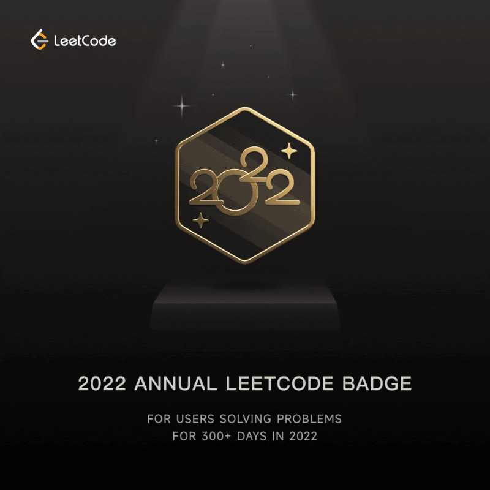
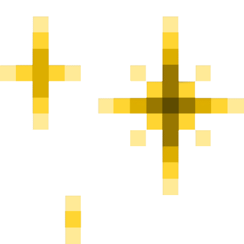

  

<centre>

  </centre>

## Hi <developers/>! , I am <a href="https://www.linkedin.com/in/dhruva-bhattacharya-14843915b/">Dhruva Bhattacharya</a> 👨‍💻 and 👨‍🎓

## About Me ✍
I build backend systems that are designed to scale, not just work.
 
Currently a Software Engineer at Tata Consultancy Services, I specialize in Java + Spring Boot, building REST APIs and distributed backend services with a focus on performance, reliability, and clean architecture.
 
I’ve solved 600+ DSA problems (LeetCode 1700+), which shapes how I approach system design—breaking down complex problems into efficient, scalable solutions.
 
My work includes:
 
 • Designing backend services and APIs 
 • Working with microservices and distributed systems 
 • Exploring Generative AI integrations into real-world applications 
 
I’m actively looking for SDE roles where I can:
 
 • Build high-scale backend systems 
 • Work on performance-critical applications 
 • Contribute to strong engineering teams
 

<h2 align="center"><b>Backend Engineer @ Tata Consulataqcy Services Alibaba Cloud Low-Code Development Winner & 600+ problems & 1700+ contest rating on LeetCode</b></h2> 

 

## All DSA Badges @LeetCode

</img>
</img>
</img>
</img>
</img>
</img>
</img>
<ing src="https://assets.leetcode.com/static_assets/marketing/2023-50.gif" width="40px"></img>
</img>
</img>
</img>
</img>
</img>
</img>
</img>
</img>
</img>
</img> 
</img>
</img>
</img>
</img>
</img>
</img>
</img>
</img>

### All my work life at one place:

 

### **My Portfolio**:

### _**My Blogs**_:

### 🔭 **Technology Stack**

#### **Programming Languages**:

&nbsp;&nbsp;&nbsp;&nbsp;&nbsp;&nbsp;&nbsp;&nbsp;&nbsp;&nbsp;&nbsp;&nbsp;&nbsp;&nbsp;

#### **Frameworks, Platforms and Libraries**:

&nbsp;&nbsp;&nbsp;&nbsp;&nbsp;&nbsp;&nbsp;&nbsp;&nbsp;&nbsp;&nbsp;&nbsp;

#### **Servers**:

&nbsp;&nbsp;

##### **Databases**:

&nbsp;&nbsp;

#### **Hosting/SaaS**:

&nbsp;&nbsp;&nbsp;&nbsp;</code>&nbsp;&nbsp;&nbsp;&nbsp;&nbsp;&nbsp;&nbsp;&nbsp;

#### **Other**:

&nbsp;&nbsp;

#### **CI/CD**:

&nbsp;&nbsp;&nbsp;&nbsp;&nbsp;&nbsp;

#### **Version Control**:

#### **ML/DL**:

&nbsp;&nbsp;&nbsp;&nbsp;&nbsp;&nbsp;&nbsp;&nbsp;

- 🔭 I’m currently working on ... Self
- 🌱 I’m currently learning to manage my time and be productive.
- 👋 Hi, I’m DHRUVA BHATTACHARYA
- 👀 I’m interested in ... competative programming 
- 🌱 I’m currently learning ... c/c++
- 💞️ I’m looking to collaborate on ... Open Source and AI related Project
- 🔥 WEB DEVELOPMENT
- 😄 Pronouns: ...He/Him

                                                                                                                                  
## Watch a 🐍 eating my contribution graph

<!-- github stats and graph -->
<h1 align="center">
 𝐆𝐈𝐓𝐇𝐔𝐁 𝐒𝐓𝐀𝐓𝐒 
</h1>

  

                  
 

<h2 align="center"></h2>

<h3 align="center">Show some ❤ by  some repositories .</h3>

 

---
